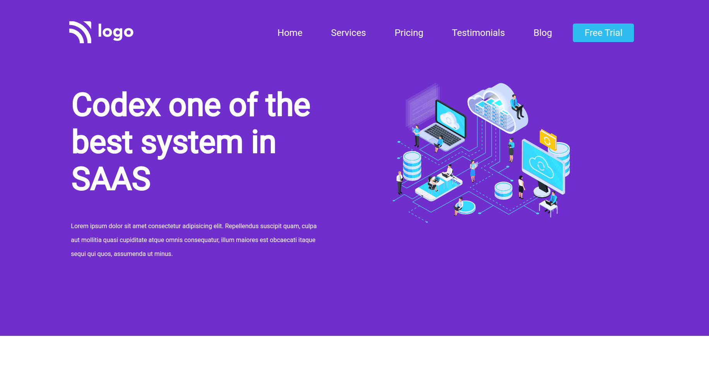
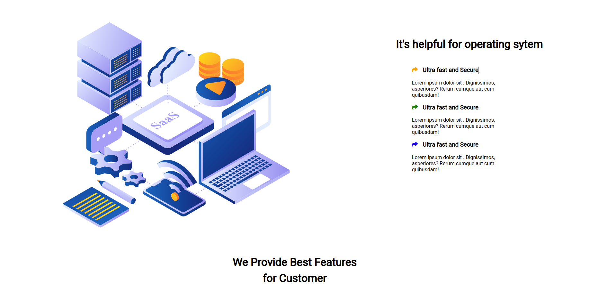
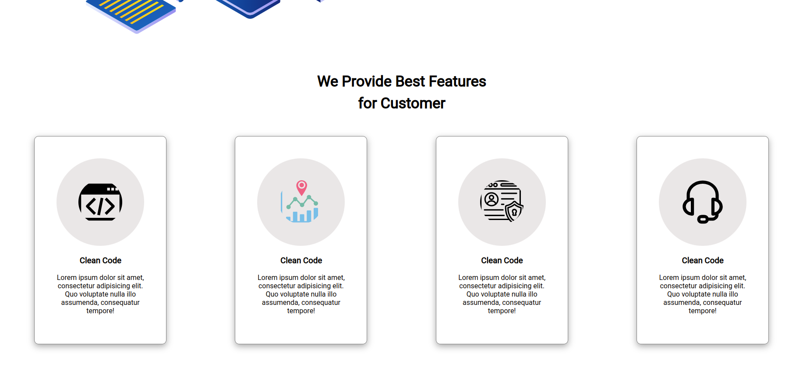
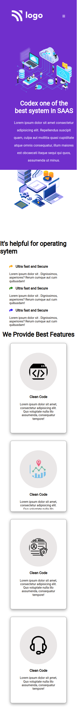

## JSFS (Project 13)
---

Hi

This is a FSJS Live Class Project No.13 Repo. In this project, I have learn a lot a new HTML & CSS properties. I have written good amount of code lenght and made responsive too. This project have mulitple sections and modern web page screen.
I have used flex, positions, background color, navigations and orther HTML & CSS properties.

I would like to say Thankyou my instructor `Hitesh Choudhary` for the guiding, mentoring and pushing me hard so that I can learn and develop this project.

### Stack Used :
---

### Live Link :

> [Live Url](https://rajendra-project-13.netlify.app/)

### Mockups
---

 

### 
---

 

### 
---

 

### Mobile Screen
---

 